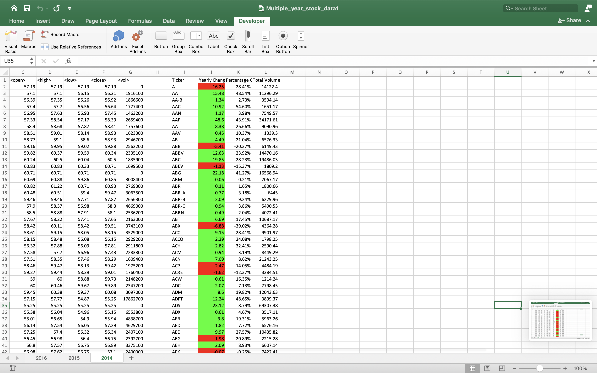
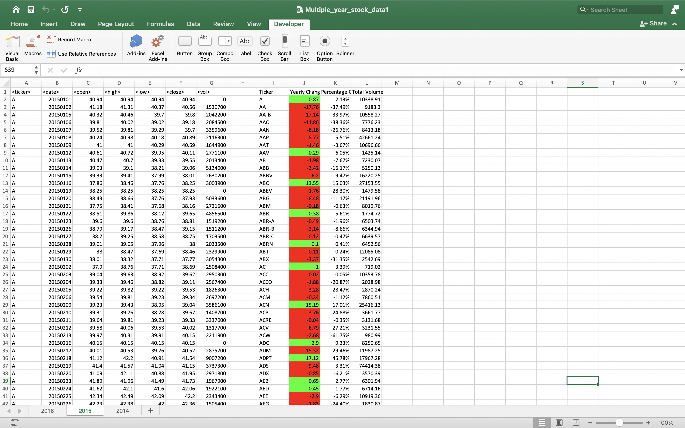
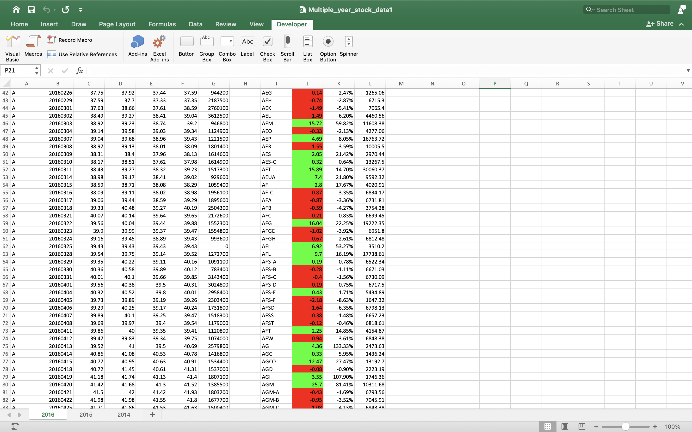

# VBA Challenge - VBA of Wall Street

## Background

Analyzing stock market data using VBA scripting

### Files

* [Test Data](Resources/alphabetical_testing.xlsx)

* [Stock Data](Multiple_year_stock_data.xlsx)

### Stock market analyst

## Thought Process
- [x] Extract each Tickers by name, yearly change, percentage change, and total volume
- [x] Created a starting point
- [x] Named the Stock Summary Columns
- [x] Looped through Tickers (Abbv. of Stocks)
- [x] Grabbed Ticker
- [x] Grabbed Total Volume
- [x] Grabbed Yearly Change & Percentage Change
